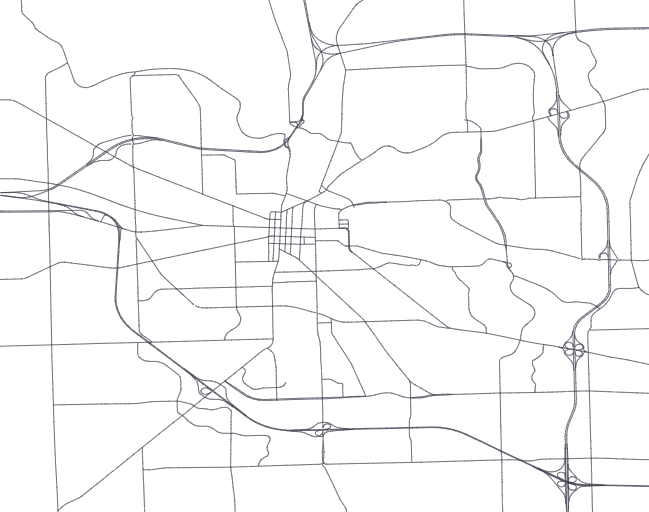

# Open Knowledge Network (OKN)
### 1. How complete is HPMS (and its underlying referencing systems) nationally? How open is it across states?

The [website](https://www.fhwa.dot.gov/policyinformation/hpms/shapefiles.cfm) has shapefiles for all 50 states, DC and PR. There is also a national shapefile which has a subset of the roads in the state files.

The data are organized by States reflecting highways that are part of the HPMS-defined Federal-Aid System:
1. Interstate
2. Principal Arterial – Other Freeways and Expressways
3. Principal Arterial – Other
4. Minor Arterial
5. Major Collector
6. Urban Minor Collector
Additionally, any other highways that are designated as part of the National Highway System

See example below of coverage for Ann Arbor HPMS

---
### 2. How similar are the road segments in OSM and Framework (as an example)?

Framework road segments are usually defined by intersections at its endpoints. MTCF previously defined intersections as any endpoint with 3 or more road segments connecting to it. 

OSM road segments (Way) terminate at more arbitrary endpoints (nodes) that do not necessarily coincide with intersections. So they can be shorter or longer than the distance between two intersections.

See example below of an OSM Way that is shorter than two intersections

---
### 3. What would be involved in mapping between these two systems?

OSM road segments consists of nodes. Nodes are GPS points that define the road segment. There are nodes in the road segments that define intersections. 
- We would have to locate the intersection nodes in OSM. 
- Then we could do map matching using the endpoints of road segments to intersection nodes in OSM (or vice versa)

Fortunately, Scott Bogard, has done item one already. He has constructed a table of all intersection nodes in the continental USA. It is located on the server `tri.esg.gm1` in the database `OSM2019`.
